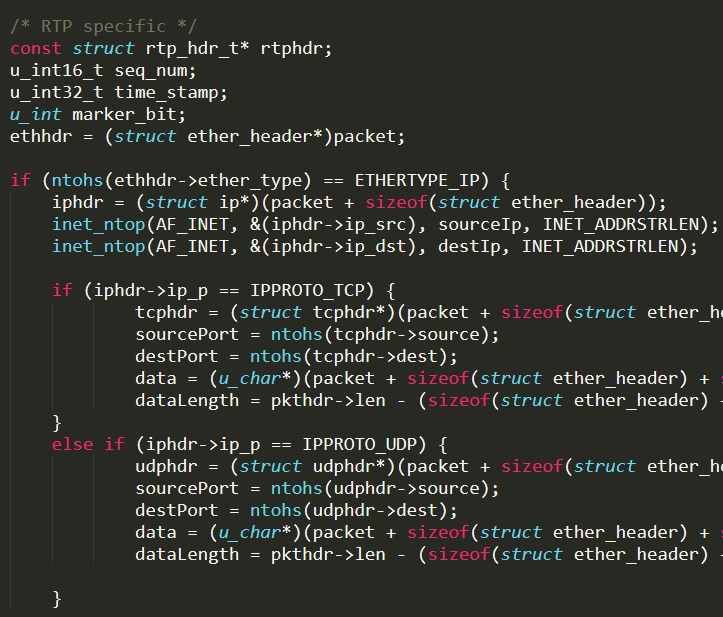

# pcap-reader
  
   ## Table of Contents
  * [Description](#description)
  * [Sneak-Peek](#sneak-peek)
  * [Contributing](#contributing)
  * [Questions?](#questions) 
  
  
  ## Description
This RTP processing program was written for my Data Networking and Communications (CS 380) class at STAC. We were instructed to modify pcap-reader to process an RTP capture file. This had required us to define an RTP header structure as well. Then skip over L2, L3, and L4 to get to the RTP header.

For each packet we had to display the following:
Ethernet
Source and Destination Address

IP
Source and Destination Address
Protocol

UDP
Source and Destination Port

RTP
The Marker bit (true/false)
The 16-bit sequence number
The 32-bit timestamp

The program would then be compiled and run using the audio.cap file associated with the assignment, as the file is a capture of audio running on an IP network.

  
  ## Sneak-Peek

  
  ## Contributing
  
  Contributions are always accepted.
  
  ---
  
  ## Questions?
  
   
  
  For any questions, please contact me with the information below:
 
  Email: <<enter your email here>>
